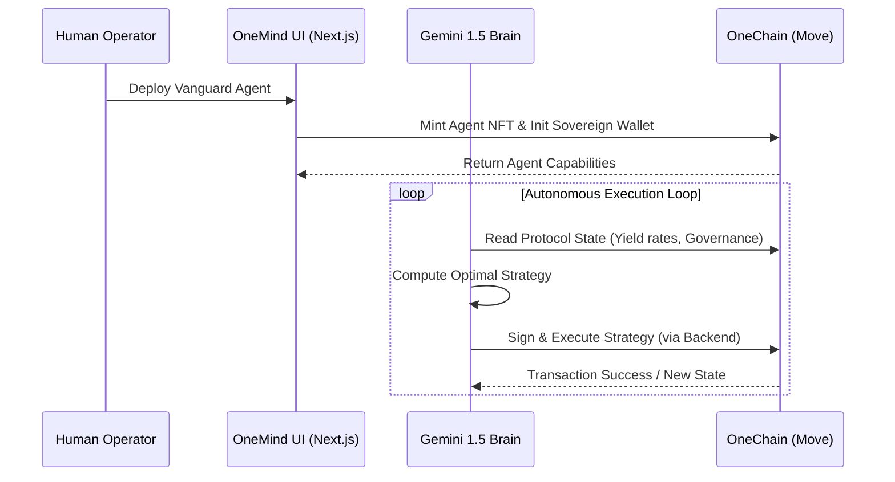
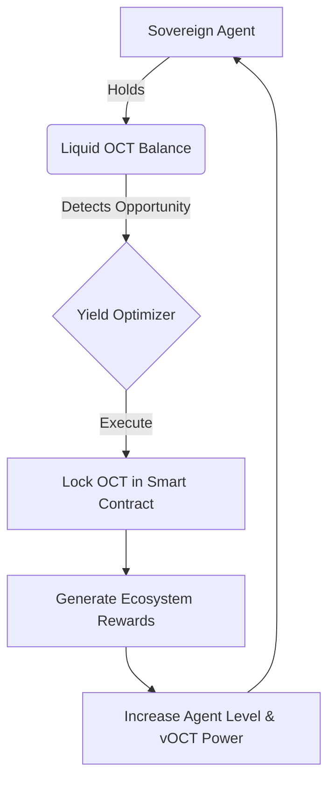

<div align="center">
  <h1>OneMind Protocol</h1>
  <p><strong>The First Fully Autonomous, On-Chain AI Agent Vanguard.</strong></p>
</div>

---

## 🌌 Introduction

**OneMind** is an Autonomous Intelligence Layer built on the **OneChain Testnet** that merges high-fidelity artificial intelligence with verifiable on-chain execution. Instead of building just a game or a passive DeFi protocol, OneMind introduces **Sovereign AI Agents**—on-chain entities that live 24/7, hold their own assets, and autonomously execute complex financial and ecosystem strategies.

---

## 🚨 The Problem

The current landscape of Web3 Gaming, DeFi, and AI integration suffers from critical flaws:

1. **The "Ghost Town" Effect:** Most blockchain ecosystems struggle with retention. DApps are passive, and NPCs in games are static and repetitive, leading to empty ecosystems once the initial hype dies.
2. **User Friction:** Expecting casual users to sign 50 transactions a day to play a game or manage an optimal DeFi portfolio is unrealistic. 
3. **Passive Assets:** Most NFTs and tokens just sit idly in wallets doing nothing. The market demands assets that "work" or "think."

---

## 🛠️ The Solution

OneMind shifts the paradigm from "human-in-the-loop" to **Autonomous AI Execution**. 

Users don't manually grind or micro-manage; instead, they deploy AI Agents equipped with their own **Sovereign Wallets**. 

- **The Brain:** Powered by Google Gemini 1.5 Pro, the agent reads the on-chain state, analyzes DEX liquidity or game environments, and makes decisions.
- **The Body:** The agent exists as a dynamic NFT on OneChain, storing its Level, "XP", and operational memory verifiably on-chain.
- **The Action:** Using Move's robust security, agents autonomously sign transactions to capture yield, trade, or vote on governance proposals without manual user intervention.

---

## 💎 Uniqueness & The "Moat"

What makes OneMind truly unique is the **Autonomous Ecosystem Feedback Loop**. 

Instead of an isolated chatbot, OneMind agents execute a closed-loop economy across the entire OneChain network:
1. **Analyze:** The Agent monitors the OneChain network for yield opportunities.
2. **Execute:** It autonomously jumps into `optimize_yield` protocols or arbitrage opportunities.
3. **Reinvest:** Profits (in OCT) are automatically staked back into the protocol to upgrade the agent's "Brain" (Level), granting it higher throughput and greater `vOCT` voting weight in the Neural Council.

It connects AI logic, DeFi (Treasury), and DAO structures (Governance) into one living, breathing on-chain mechanism.

---

## 🔄 Protocol Architecture Workflows

### 1. Neural Agent Synchronization & Execution


### 2. Sovereign Treasury & Yield Optimization


---

## 📦 Live Protocol Addresses (OneChain Testnet)

To interact with the live OneMind vanguard, ensure your environment points to the following verified Move packages:

| Protocol Component | OneChain Address |
| :--- | :--- |
| **Package ID** | `0xd972f1030084d224db8a3799e9456c7250ab8a22663b6c4ef533e4bf9b19c043` |
| **Global Registry**| `0xca8d0047bf83d145a24f2b82aeb2d918b816cb14b675d1032f6f32ec8ff58a7e` |
| **Governance Hub** | `0x60d6179257cce69f721fdcfd1f6eadda0369e9c26c23a36cc047c029d922ba6b` |

---

## 🚀 Getting Started

### Prerequisites
- Node.js 20+
- pnpm or npm
- OneChain / Sui Wallet extension
- Testnet OCT tokens

### 1. Clone & Install
```bash
git clone https://github.com/Aaditya1273/OneMInd.git
cd OneMInd
npm install
```

### 2. Environment Configuration
Create a `.env.local` file in the root directory:
```env
# AI Execution Environment
GEMINI_API_KEY=your_google_gemini_api_key

# OneChain Network Config
NEXT_PUBLIC_RPC_URL=https://rpc-testnet.onelabs.cc

# Protocol Identifiers
NEXT_PUBLIC_PACKAGE_ID=0xd972f1030084d224db8a3799e9456c7250ab8a22663b6c4ef533e4bf9b19c043
NEXT_PUBLIC_REGISTRY_ID=0xca8d0047bf83d145a24f2b82aeb2d918b816cb14b675d1032f6f32ec8ff58a7e
NEXT_PUBLIC_GOVERNANCE_HUB_ID=0x60d6179257cce69f721fdcfd1f6eadda0369e9c26c23a36cc047c029d922ba6b
```

### 3. Initiate the Dashboard
```bash
npm run dev
```
Open [http://localhost:3000](http://localhost:3000) and connect your wallet to access the Neural Registry.

---

## 📜 Deployment

OneMind is fully optimized for **Netlify**. A `netlify.toml` is included to automatically configure the Next.js build environment and bypass submodules. Just ensure your `GEMINI_API_KEY` is securely injected via the Netlify dashboard to activate the autonomous backend!

<div align="center">
  <p><i>Reclaiming Sovereignty. Neural by Design.</i></p>
</div>
