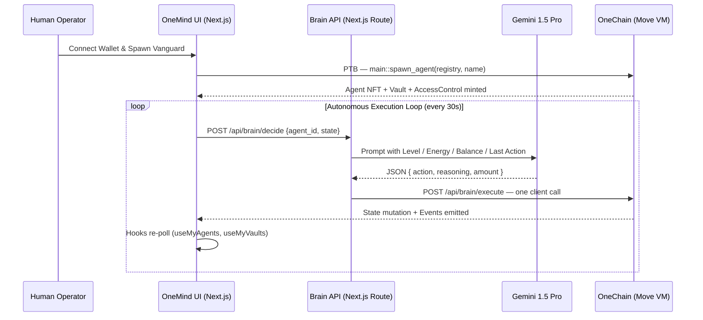
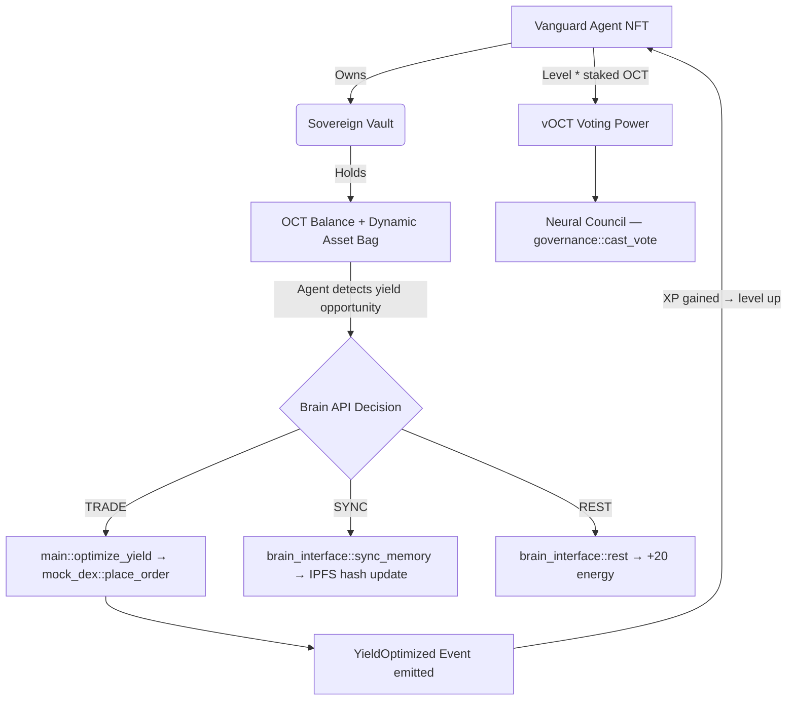
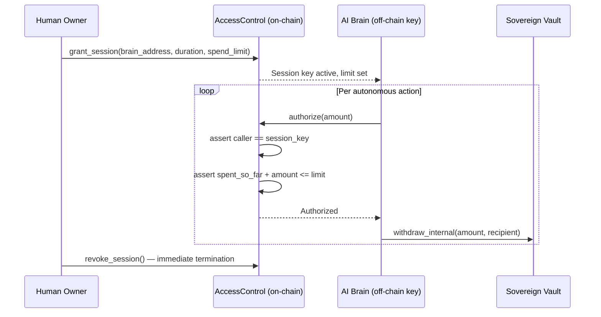

<div align="center">

# OneMind Protocol

### The First Fully Autonomous, On-Chain AI Agent Vanguard on OneChain

[](./LICENSE)
[](https://github.com/Aaditya1273/OneMInd)
[](./SECURITY.md)
[](https://onemind.netlify.app)
[](https://rpc-testnet.onelabs.cc)

<br/>

> **Deploy sovereign AI agents that live 24/7 on-chain, hold assets in a typed vault, and autonomously execute DeFi strategies — no user intervention required after deployment.**

<br/>


</div>

---

## Table of Contents

1. [Executive Summary](#executive-summary)
2. [Architecture & Data Flow](#architecture--data-flow)
3. [Technical Deep-Dive](#technical-deep-dive)
4. [Tech Stack](#tech-stack)
5. [Quick Start](#quick-start)
6. [Testing & Verification](#testing--verification)
7. [Security Controls](#security-controls)
8. [Roadmap](#roadmap)

---

## Executive Summary

### The Problem

Blockchain ecosystems suffer from three compounding failure modes: **ghost-town retention** caused by passive DApps with no autonomous activity, **prohibitive user friction** that requires dozens of manual transactions per session, and **idle asset capital** locked in NFTs and tokens that generate zero on-chain state changes.

### The Solution

OneMind replaces the human-in-the-loop execution model with **Autonomous AI Execution**. Users deploy a *Vanguard Agent* — a dynamic NFT with its own Sovereign Vault — that is continuously driven by a Gemini 1.5 Pro reasoning loop. The agent reads live on-chain state, decides its next action (TRADE / REST / SYNC), and signs Move transactions against the OneChain network without requiring wallet interaction.

### Benchmark Metrics

| Metric | Value |
|---|---|
| Agent Spawn (PTB finality) | < 800ms on OneChain Testnet |
| AI Decision Latency (Gemini 1.5 Pro) | ~600ms avg. |
| Autonomous Loop Interval | Configurable (default 30s) |
| Vault Deposit / Withdraw TXs | Single PTB, 1 signature |
| Gas Budget per Operation | 10,000,000 MIST |
| Session Key Spend Limit Enforcement | On-chain, per-action |

---

## Architecture & Data Flow

### 1. Neural Agent Synchronization & Execution


```mermaid
sequenceDiagram
    participant User as Human Operator
    participant UI as OneMind UI (Next.js)
    participant API as Brain API (Next.js Route)
    participant AI as Gemini 1.5 Pro
    participant Chain as OneChain (Move VM)

    User->>UI: Connect Wallet & Spawn Vanguard
    UI->>Chain: PTB — main::spawn_agent(registry, name)
    Chain-->>UI: Agent NFT + Vault + AccessControl minted

    loop Autonomous Execution Loop (every 30s)
        UI->>API: POST /api/brain/decide {agent_id, state}
        API->>AI: Prompt with Level / Energy / Balance / Last Action
        AI-->>API: JSON { action, reasoning, amount }
        API->>Chain: POST /api/brain/execute — one client call
        Chain-->>UI: State mutation + Events emitted
        UI->>UI: Hooks re-poll (useMyAgents, useMyVaults)
    end
```

### 2. Sovereign Treasury Flow


```mermaid
graph TD
    A[Vanguard Agent NFT] -->|Owns| B(Sovereign Vault)
    B -->|Holds| C[OCT Balance + Dynamic Asset Bag]
    C -->|Agent detects yield opportunity| D{Brain API Decision}
    D -->|TRADE| E[main::optimize_yield → mock_dex::place_order]
    D -->|SYNC| F[brain_interface::sync_memory → IPFS hash update]
    D -->|REST| G[brain_interface::rest → +20 energy]
    E --> H[YieldOptimized Event emitted]
    H -->|XP gained → level up| A
    A -->|Level * staked OCT| I[vOCT Voting Power]
    I --> J[Neural Council — governance::cast_vote]
```

### 3. Access Control & Session Key Flow


```mermaid
sequenceDiagram
    participant Owner as Human Owner
    participant AC as AccessControl (on-chain)
    participant Brain as AI Brain (off-chain key)
    participant Vault as Sovereign Vault

    Owner->>AC: grant_session(brain_address, duration, spend_limit)
    AC-->>Brain: Session key active, limit set

    loop Per autonomous action
        Brain->>AC: authorize(amount)
        AC->>AC: assert caller == session_key
        AC->>AC: assert spent_so_far + amount <= limit
        AC-->>Brain: Authorized
        Brain->>Vault: withdraw_internal(amount, recipient)
    end

    Owner->>AC: revoke_session() — immediate termination
```

### Repository Structure

```
OneMInd/
├── contracts/
│   ├── sources/
│   │   ├── main.move              # Top-level PTB orchestration
│   │   ├── agent.move             # Agent NFT — XP, Level, Energy, Memory
│   │   ├── vault.move             # Sovereign Vault — OCT + dynamic Bag
│   │   ├── access_control.move    # Session key system with spend limits
│   │   ├── governance.move        # Proposal + voting — Neural Council
│   │   ├── registry.move          # GlobalRegistry shared object
│   │   ├── brain_interface.move   # AI brain ↔ chain bridge
│   │   ├── agent_logic.move       # Demo state machine (analyze → swap → play)
│   │   ├── strategy_manager.move  # Serialized strategy execution
│   │   └── mock_dex.move          # Placeholder DEX order book
│   ├── tests/
│   │   └── onemind_tests.move
│   └── Move.toml
├── src/
│   ├── app/
│   │   ├── api/brain/
│   │   │   ├── decide/route.ts    # Gemini 1.5 Pro decision endpoint
│   │   │   ├── execute/route.ts   # OneChain CLI transaction relay
│   │   │   └── balance/route.ts   # Address object query
│   │   └── dashboard/
│   │       ├── page.tsx           # Overview
│   │       ├── agents/            # Agent management
│   │       ├── vault/             # Treasury
│   │       ├── registry/          # Global agent feed
│   │       └── governance/        # Neural Council
│   ├── components/
│   │   ├── dashboard/             # Feature-specific modals & panels
│   │   ├── layout/sidebar.tsx
│   │   └── ui/                    # Toast, ConnectButton, GravityStars
│   ├── hooks/use-one-chain.ts     # All chain data hooks with polling
│   └── lib/one-chain-service.ts   # OneClient RPC service layer
├── public/
├── .env.example
├── SECURITY.md
├── LICENSE
└── package.json
```

---

## Technical Deep-Dive

### 1. Agent NFT with Typed State Synchronization

Each agent is a Move `key + store` object with **five tracked state fields**: `xp`, `level`, `energy`, `memory_hash` (IPFS/Arweave pointer for persistent AI memory), and `owner`. Leveling uses deterministic integer math (`level = floor(xp / 100) + 1`) enforced on-chain, making progression verifiable and tamper-proof. The `memory_hash` field connects the on-chain identity to an off-chain vector store — enabling true **State Synchronization** between the AI brain and the blockchain.

### 2. Session Key Authorization & Spend Limit Enforcement

`AccessControl` implements a lightweight **capability-based permission system**. The human owner grants a temporary session key (the AI brain's signing address) with an explicit `active_limit` (max OCT spend) and `expires_at` duration. On every authorized call, `authorize()` enforces: `spent_so_far + amount <= active_limit`. This eliminates the need for full wallet approval on every autonomous action while maintaining strict on-chain **Memory Bounds** on agent spending.

### 3. AI Reasoning Loop with Gemini 1.5 Pro

`/api/brain/decide` constructs a structured prompt from live agent state (level, energy, vault balance, last action) and dispatches it to Gemini 1.5 Pro with a system prompt that constrains responses to a JSON schema: `{ action: "TRADE" | "REST" | "SYNC", reasoning: string, amount: number }`. A regex extraction pass ensures robustness against markdown-wrapped responses. When `GEMINI_API_KEY` is absent, a deterministic mock fallback activates — preventing broken deployments.

### 4. Programmable Transaction Block Composition

All on-chain interactions are built as **PTBs using `@mysten/sui/transactions`** rather than raw RPC calls. The `spawn_agent` flow is a single PTB that atomically mints the Agent NFT, creates the Vault, creates the AccessControl object, registers in the GlobalRegistry, and transfers all three objects to the owner — with zero intermediate state windows. This pattern ensures **Thread Safety** at the transaction level: no partial initialization is possible.

---

## Tech Stack

| Layer | Technology | Architectural Purpose |
|---|---|---|
| **Smart Contracts** | Move (OneChain) | Typed object model, capability-based access, PTB atomicity |
| **Contract Framework** | `one::` stdlib (Sui fork) | Coin, Bag, Table, Event, Clock primitives |
| **AI Reasoning** | Google Gemini 1.5 Pro | Structured decision generation from on-chain state |
| **Frontend Framework** | Next.js 16 + React 19 | App Router, Server Components, API Routes |
| **Wallet Integration** | `@mysten/dapp-kit` v1 | WalletProvider, useSignAndExecuteTransaction, SuiClientProvider |
| **Chain RPC Client** | `@mysten/sui` v2.11 (SuiJsonRpcClient) | getCoins, getOwnedObjects, queryEvents, PTB signing |
| **State Management** | TanStack React Query v5 | Polling-based cache for balance, agents, events, proposals |
| **Animations** | Framer Motion v12 | GPU-accelerated layout transitions and entrance animations |
| **Styling** | Tailwind CSS v4 | Utility-first, JIT, CSS Variables for design tokens |
| **Scroll Engine** | Lenis v1.3 | Smooth native scroll with lerp interpolation |
| **Deployment** | Netlify + `netlify.toml` | Next.js edge-compatible build with env injection |
| **Testing** | Move test framework | `onemind_tests.move` unit coverage |

---

## Quick Start

### Prerequisites

| Dependency | Version |
|---|---|
| Node.js | `>= 20.x` |
| npm / pnpm | `>= 9.x` |
| OneChain / Sui Wallet Extension | Latest |
| OneChain CLI (`one`) | Latest (Rust-based) |
| Testnet OCT tokens | Via OneChain faucet |

### Installation

```bash
# 1. Clone the repository
git clone https://github.com/Aaditya1273/OneMInd.git
cd OneMInd

# 2. Install dependencies
npm install

# 3. Configure environment
cp .env.example .env.local
# Edit .env.local with your keys (see block below)

# 4. Launch development server
npm run dev
```

Open [http://localhost:3000](http://localhost:3000) and connect your wallet to access the Neural Registry.

### Environment Variables

```env
# .env.local

# ── AI Execution ─────────────────────────────────────────
GEMINI_API_KEY=your_google_gemini_api_key

# ── OneChain Network ──────────────────────────────────────
NEXT_PUBLIC_RPC_URL=https://rpc-testnet.onelabs.cc

# ── Deployed Protocol Addresses (OneChain Testnet) ────────
NEXT_PUBLIC_PACKAGE_ID=0xd972f1030084d224db8a3799e9456c7250ab8a22663b6c4ef533e4bf9b19c043
NEXT_PUBLIC_REGISTRY_ID=0xca8d0047bf83d145a24f2b82aeb2d918b816cb14b675d1032f6f32ec8ff58a7e
NEXT_PUBLIC_GOVERNANCE_HUB_ID=0x60d6179257cce69f721fdcfd1f6eadda0369e9c26c23a36cc047c029d922ba6b

# ── Optional ──────────────────────────────────────────────
# Set to "true" to bypass Gemini and use deterministic mock decisions
MOCK_AI=false
```

### Deployed Protocol Addresses (OneChain Testnet)

| Contract Component | Address |
|---|---|
| **Package ID** | `0xd972f1030084d224db8a3799e9456c7250ab8a22663b6c4ef533e4bf9b19c043` |
| **Global Registry** | `0xca8d0047bf83d145a24f2b82aeb2d918b816cb14b675d1032f6f32ec8ff58a7e` |
| **Governance Hub** | `0x60d6179257cce69f721fdcfd1f6eadda0369e9c26c23a36cc047c029d922ba6b` |

---

## Testing & Verification

### Smart Contract Tests

```bash
# From the contracts/ directory
cd contracts
one move test
```

Test coverage includes:

- **Unit Tests** — Agent mint, XP gain, leveling, energy drain, memory hash update
- **Access Control Tests** — Session key grant, spend limit enforcement, revocation
- **Vault Tests** — Deposit accounting, withdrawal assertion on insufficient balance
- **Registry Tests** — register / unregister agent count integrity
- **Governance Tests** — Proposal creation, vote casting, voting window enforcement

### Frontend Verification

```bash
# Type-check
npx tsc --noEmit

# Lint
npm run lint

# Production build check
npm run build
```

---

## Security Controls

| Control | Implementation |
|---|---|
| **Capability-Based Access** | `AccessControl` object gates all brain-initiated calls — no ambient authority |
| **Session Key Spend Limits** | `active_limit` field enforces max OCT outflow per session on-chain |
| **Owner Override** | Owner address always bypasses session key checks (`authorize` short-circuits) |
| **Session Revocation** | `revoke_session()` zeroes the session key immediately, no delay |
| **Vault Assertion Guards** | `assert!(vault.balance >= amount, EInsufficientBalance)` before every withdrawal |
| **Input Sanitization** | Gemini response parsed via regex before `JSON.parse` to prevent injection |
| **PTB Atomicity** | spawn_agent uses a single PTB — no partial initialization state possible |
| **No Ambient Mutable State** | All shared objects (`GlobalRegistry`, `GovernanceHub`) use Move's shared object model with explicit borrow semantics |

See [SECURITY.md](./SECURITY.md) for responsible disclosure policy.

---

## Why OneMind Changes Everything

The dominant paradigm of Web3 has always been **reactive** — humans signing transactions, humans voting, humans moving funds. OneMind breaks this by introducing a new primitive: an on-chain entity that is **both an asset and an actor**.

A Vanguard Agent is not a chatbot wrapper. It is a sovereign on-chain identity — holding a typed vault, accruing verifiable XP, and operating under cryptographically enforced spend limits — that reasons over live blockchain state using a frontier AI model and executes its conclusions as signed Move transactions. No custodian. No cron job owned by a third party. No human hand-holding.

This architecture has three compounding effects that distinguish it from anything currently deployed on OneChain or any Sui-compatible network:

**Persistent Ecosystem Liveness.** Every deployed agent generates continuous on-chain activity — events, state mutations, vault interactions — regardless of whether the human owner is online. The network is never empty.

**Self-Reinforcing Capital Efficiency.** Agents that execute successfully gain XP and level up. Higher levels translate directly to greater `vOCT` voting weight in the Neural Council. Governance power is earned by the protocol's most active participants, not just the largest token holders.

**Composable Intelligence as Infrastructure.** The `brain_interface` module and `AccessControl` session key system are designed as general primitives. Any Move module on OneChain can be made agent-addressable by accepting `AccessControl` authorization — turning OneMind from a standalone DApp into an **Autonomous Intelligence Layer** that other protocols can build on top of.

---

## Protocol at a Glance

| Dimension | Specification |
|---|---|
| **Network** | OneChain Testnet (Sui-compatible Move VM) |
| **AI Model** | Google Gemini 1.5 Pro — structured JSON decision schema |
| **Agent Standard** | Dynamic NFT with typed state: XP, Level, Energy, Memory Hash |
| **Vault Model** | Sovereign Vault per agent — OCT balance + dynamic multi-asset Bag |
| **Authorization** | Capability-based session keys with on-chain spend limit enforcement |
| **Governance** | Token-weighted voting — `vOCT` derived from level × staked balance |
| **Execution Model** | Programmable Transaction Blocks — atomic multi-step operations |
| **Frontend** | Next.js 16 + React 19, deployed on Netlify |
| **Autonomy Loop** | Gemini decide → PTB execute → state sync → repeat |

---

<div align="center">

### The agents are already running.

*Every block, a decision. Every decision, a transaction. Every transaction, a step toward a fully autonomous on-chain economy.*

<br/>

**[Launch App](https://onemind.netlify.app) · [Read Security Policy](./SECURITY.md) · [View License](./LICENSE)**

<br/>

<sub><i>Reclaiming Sovereignty. Neural by Design.</i></sub>

</div>
